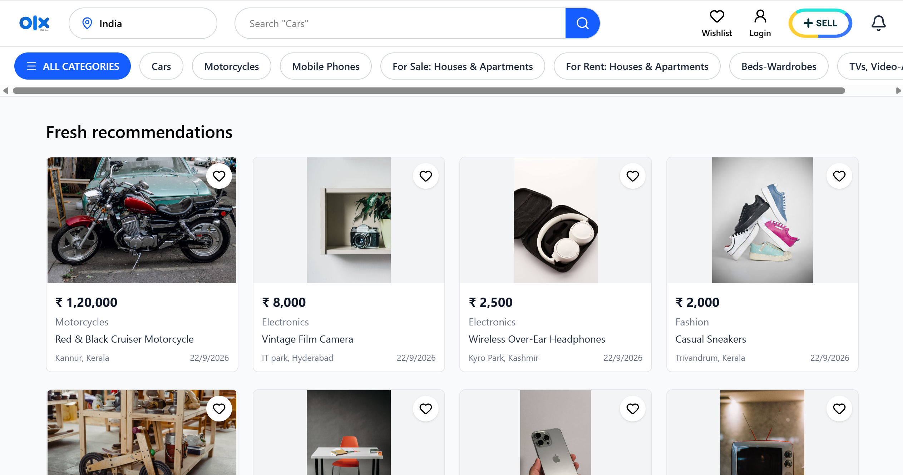
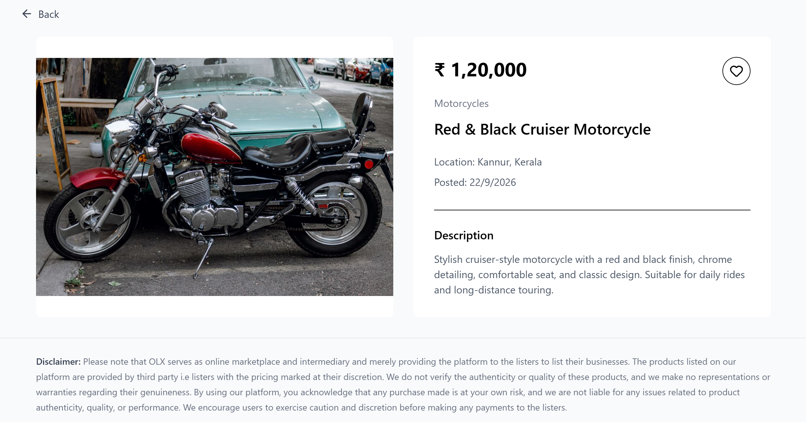
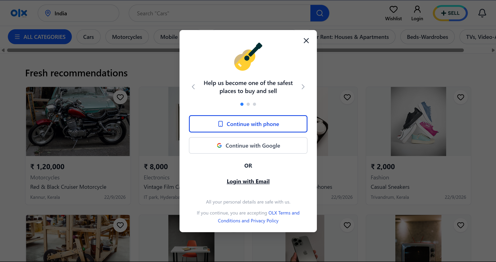
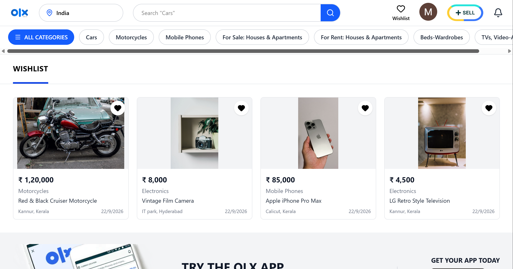
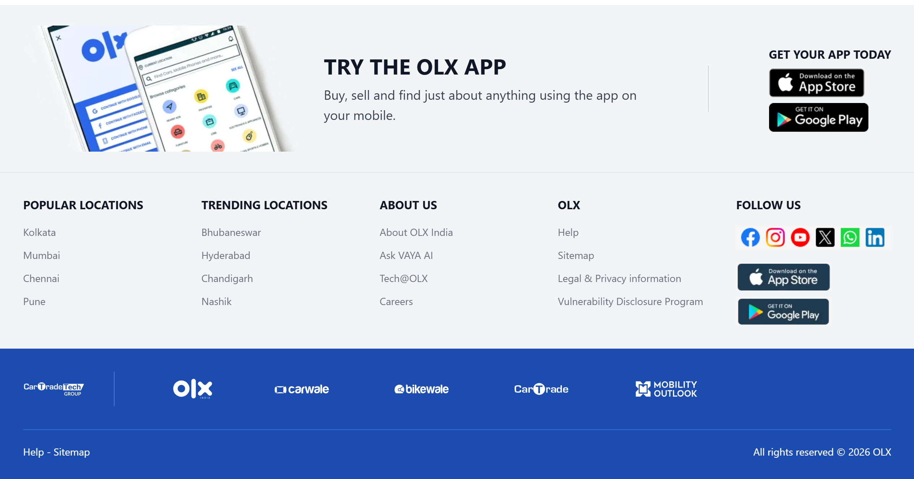

# 🛍️ OLX Clone 2026

**An OLX-inspired online marketplace built from scratch with React, TypeScript, Firebase, and Tailwind CSS.**

 

  

## Preview

  
  

  
  

  

 

## Highlights

- 🔐 Firebase Authentication & Firestore
- 🏷️ Sell & List Products
- ❤️ Favourite Listings
- 📄 Product Details & Information
- 📱 Fully Responsive, OLX-inspired UI

 

## Stack

`React` · `TypeScript` · `Firebase` · `Tailwind CSS`

 

